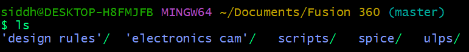
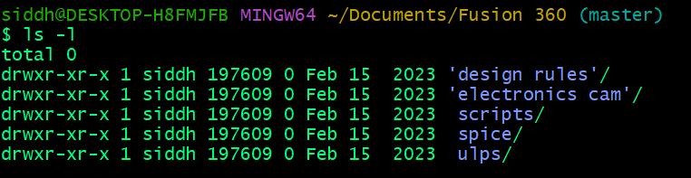
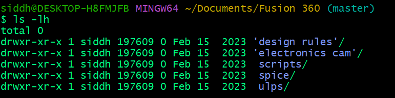
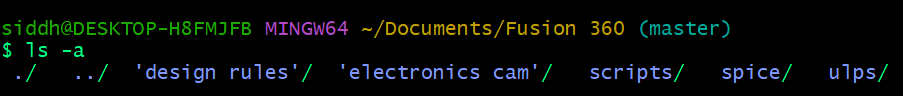
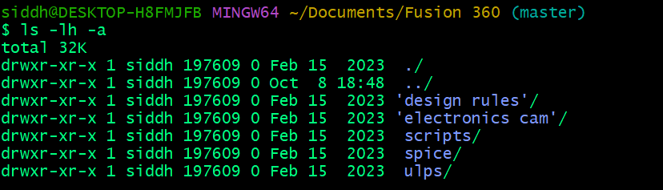
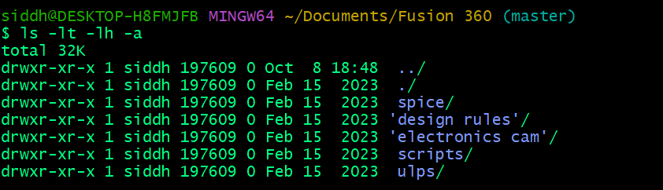
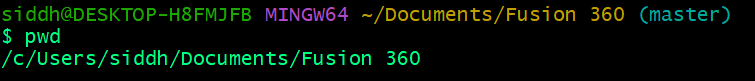
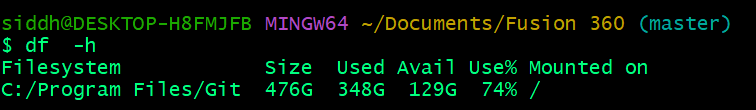

# **Linux Commands**

# Creating Directories and Files Using Linux CLI

### mkdir - Make Directory

Create single or a nested directory with `mkdir` command.

```bash
mkdir MyProject
```

The above command will create a brand new folder named as `MyProject` which will be initially empty

```bash
mkdir MyContent/src
```

Here, we are trying to create a src folder inside the MyContent folder, but if MyContent folder doesn't exist the this command will throw us an error.
`bash mkdir: MyContent: No such file or directory `

So, if we want that, the command should create the parent directory also in case it is not present and then inside the parent directory create the child directory we can use the `-p` flag althogether.

```bash
mkdir -p MyContent/src
```

Now, Linux will create MyContent folder if it dosen't exixt and then inside it, there will be a src directory created.

### ls - Listing directory content

We can use the `ls ` command to explore differnt way of listing files and folders present inside the current directory.

```bash
ls
```

The above command will list down all the files and folders inside a directory.



if we see, then we don't have much details about thr files and folders here. if we want more details like time of creation, user, size etc we can use the `-l` flag.

```bash
ls -l # this will give long listing of the content
```



Here the size are not in an understandable formate, so we can use the `lh` flag to have sizes represnted in husman readable form.



If we want to list all the hidden files and folders using the `ls` command then we can give a `-a`flag, which will display normal folder and folders along with the hidden ones.


We can also club the usage of multiple flags, like use `-lh` to have detailed listing and human
readable sizes along with `-a` to enable this for hidden files and folders also.


We can use the `-lt` flag to sort our content based on the modified time.

So, here we have clubbed `-lt` with other flags to combine their usecases.

### pwd - Print Working directory

If we want to identify the current directory where we are executing the linux commands form the terminal then we can use the `pwd` command.


### touch - Create empty files in Linux

To create a brand new empty file in the current working directory using linux command line interface we can use the `touch` command where we can write touch and mention name of the file we want to create and it will create a brand new file for us.

```bash
touch file.txt
```

One advanced use case is that, if we want to generate multiple files, ending with some sequence number then we can write

```bash
touch file{1...5}.txt
```

This command will create 5 files named as `file1.txt` , `file2.txt` , `file3.txt` and so on.

### rm - Command used to remove files

If we want to delete an already existing file we can use the `rm` command which just takes the file name and then, if it exists deletes it.

```bash
rm file.txt
```

If we want to delete a directory then the `rm` command will not be able to directly delete the directory. We can use the `-r` flag in order to recursively delete the directory and everything like subfolders and files inside the directory.

### cd - Change Directory

In linux if we want to move from one folder to another using the command line then we can use the `cd` command. This command will take us to the desired directory. There are multiple ways to use this command.

```bash
cd path_to_the_folder
```

To give the path to the folder we have two ways:

1. Absolute path
2. Relative path

To Understand this path mechanisum we need to know basic flies strcture in linux.

In Linux, at the top we have a root directory represented by `/` . Then we have a bunch of folders inside it. One of the folders is Users which has one more folder with your username say `siddh` . This directory that starts from root and goes to `siddh` i.e. `/Users/siddh` is called as home directory which is in short form represented by `~` .

### Relative Path

Relative path means that standing inside one folder how should we navigate to move to another folder.

Fox example in the image above let's say we are inside the `/Fusion 360` folder. Form this we want to go to `scripts`

```bash
cd scripts
```

Because `scripts` is directly inside the `Fusion 360` folder, we just moved there from the `Fusion 360` folder. If we are inside any folder and we want to go back to the parent folder we can use .. with cd.

```bash
cd ..
```

If we are in `scripts` this cd .. will bring us back to the `Fusion 360` folder.
If we put multiple .. separated by / then we can come out of multiple nested folders.

Example: If we are inside the `scripts`, then

```bash
cd ../..
```

### Absolute Path

In an absolute path, we give the complete path of a folder from anywhere and then linux will automatically transport us to that path, but giving complete path is mandatory. So if we are inside `sripts` and we want to go to `siddh/Document/Certificate` we can say

```bash
cd siddh/Document/Certificate
```

Here the first / represents the root, then `siddh` then `Document` and then `Certificate` .
In this way we don't need to navigate from one folder to another step by step.
If from anywhere we need to come back to the home directory we say

```bash
cd ~
```

### Note

In linux files and folders are separated by / (forward slash) but in windows they are separated by \ (back slash).

### man - Manual

If we want to see the details of any command, around how to use it and what it does, we can use the `man` command.

```bash
man
```

And this will show us the details of the `ls` command that what it is, how to use it, all the flags associated etc

### cat - Concatenate and display

If we want to display results of a file then we can use the cat command. It will print wehatever is written inside the file.
And if we want to see contents of multiple files, then we can just give space separated information around name of the files and it will take the contents of the files and display it by concatenating it together and show it

```bash
cd file1.txt file2.txt
```

### whoami - Display logged in user

If we want to see who is the logged in user in the machine, we can use the whoami command.

```bash
whoami
```

This will just return the username of the logged in user.

### uname - Display system information

If we want to see some system details, like kernel name, version etc then we can use this command

```bash
uname # Show the kernel name
uname -r # Shows the kernel version only
uname -s # SHows the kernel name
uname -a # Deisplay all system info
```

### echo - Printing something in linux CLI

If we want to print something in the CLI interface we can use `echo`.

```bash
echo "Hello World
```

This will just output Hello World in the terminal.

### cp - copy files one folder to another

If we want to copy the files present in one folder to another folder we can use the `cp` command. It takes the file to be copied and the destination where we need to paste it.

```bash
cp file1.txt ../folder2/
```

So this above command will copy `file1.txt` from the current directory, move one folder out, go inside the `folder2` directory and paste it there.

### mv - cut files form one folder to another or rename files

If we want o move a file from one folder to another i.e. cut - paste, then we can use the `mv` command. It works exactly like `cp` in terms of parameters it take, it's just instead of copy pasting it will cut paste.

```bash
mv file1.txt ../folder1/
```

This command will cut `file1.txt` from the current folder and paste it to the `folder1` .
Also, apart from cut paste if we want to rename a file then also we can use `mv` command.

```bash
mv file1.txt something.txt
```

This will take `file1.txt` in the current folder and rename it to `something.txt` and preserve
all the content written inside `file1` .

## File Permission

Every file in linux has the following 3 permissions associated:

1. Read
2. Write
3. Execute

We can make a file get any combination of permissions i.e. READ WRITE, or READ EXECUTE, OR WRITE, OR EXECUTE, OR READ WRITE EXECUTE and so on.
So a file can may be have all these 3 permissions or a subset of them.

These permissions are associated on different level of ownership. Ownership is based on user level, that it includes:

1. user who owns the file
2. user group that owns the file
3. other users who has acces to the system
4. all the users of the system

for any user of the machine we can separatly define what permissions they have, like owner of the file can read write execute and may be other can only read.

## chmod

chmod command helps us to change permission of a file or directory.
There are two ways to use the chmod command:

1. Symbolic way

```bash
chmod [user][operator][permission] file name
```

user: User part describes which set of users who want this chmod command to affect ? It can have one of the following values:

1. **u**: Owner
2. **g**: Group
3. **o**: Other
4. **a**: all users(owner group and others)

operator: This operator tells if we want to add a permission or remove a permission or just set an exact permission by removing other. It can have the following values:

1. **+**: It will be adding a permission
2. **-**: It will be remove a permission
3. **=**: It will be allocating an exact permission and removing everything else

permission: The permission we want to associate.

1. **r**: read
2. **w**: write
3. **x**: execute

### Examples:

if we want to add execute permission for the owner of the file

```bash
chmod u+x script.sh
```

if we want to remove write permission for the group

```bash
chmod g-w script.sh
```

# System monitoring in linux

So we have a couple of commands that can help us to monitor system related things like disk usage, runing processes etc.

### df : Command to understand disk space usage

We can see that amount of disk space abilable and used using th `df` command. To make the response more human readable we can use the `-h` flag.

```bash
-h
```



### du: Check disk usage of a particular folder

`du` command can help us to check how much space a folder is taking. We can use the `-h` flag to make the output human readable.

```bash
du -h Certificate
```


if we don't mention any folder then it will recursively go to each folder in our machine show the usage.
